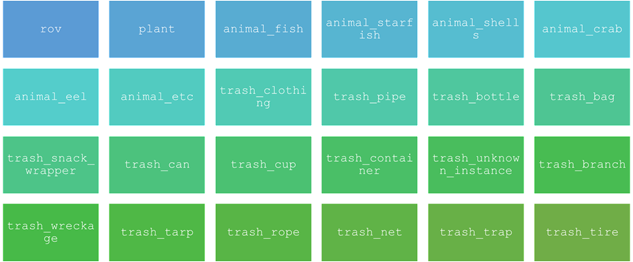
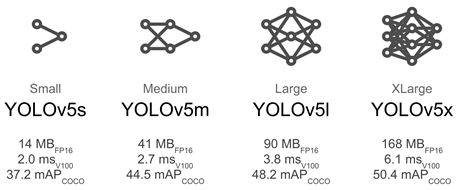
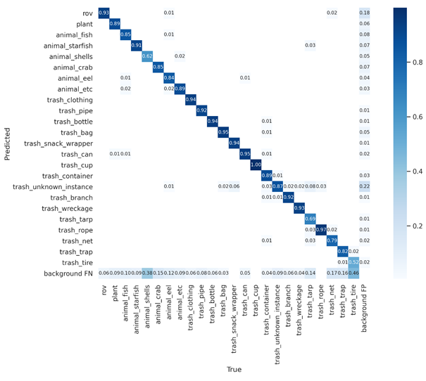

See post on Nivero's [website](https://www.nivero.no/blogg/underwater-computer-vision)

Pdf version of the article can be found [here](https://kriszieba.github.io/_posts/imgs3/www-nivero-no-blogg-underwater-computer-vision.pdf)

How to make use of computer vision algorithms in recognizing underwater objects using Yolo v5? – our experiences.

Background

Computer vision commonly refers to high-level understanding of images/videos by computers and is generally recognized as a part of deep learning field. One of the main tasks of the computer vision is object recognition – defining object boundaries or bounding boxes of specific types of objects on images and videos. A variety of object recognition algorithms (such as R-CNN, Faster R-CNN, SSD, EfficientDet and YOLO) have been applied to many tasks such as road sign recognition in autonomous cars. In comparison to on-land applications, number of underwater applications are rare. In the last years however, the field has begun growing thanks to lower prices of (under)water vehicles such as ROVs and significant development of computer vision algorithms.

In this post we will share our experiences in automatic recognition of marine litter in shallow seas (up to 100 m) by using ROVs offshore west Norway (see our blog post about “Seaplan” project). If you have access to underwater images/videos and want to detect and further analyze objects, or if you are just curious about recent developments in this field – this post is for you.

We used the most recent version of real-time object detection framework “YOLO” version 5, published on GitHub in June 2020 by Ultralytics (https://github.com/ultralytics/yolov5). Here YOLO stands for You Only Look Once. This refers to the fact that an image (or video frame) is only passed once through the FCNN (fully convolutional neural network). One of the largest contributions of YOLO v5 is to translate the Darknet research framework (used in YOLO v1-4) to the PyTorch framework.

Despite controversies in the computer vision community and lack of peer-reviewed paper YOLO v5 claims to be very fast (up to 140 frames per second), accurate and tiny (a weight model can be below 20 Mb). These properties make YOLO v5 a perfect candidate for real-time detection of the objects while moving underwater. In addition, the algorithm is well-suited to be executed on mini-computers which can be a part of ROV setup (see examples for BlueROV2; https://discuss.bluerobotics.com/t/bluerov2-with-visual-navigation-system/5215).

Installation

Installation of YOLO v5 is generally easy in comparison to previous YOLO versions. We experienced however some difficulties installing on ARM architectures (this solution worked for us; https://github.com/ultralytics/yolov5/issues/2524) or under Windows OS. The difficulties were however solved after some hours of digging the internet for solutions. Essentially the installation comes down to cloning the GitHub repository and installing required packages. 

git clone https://github.com/ultralytics/yolov5  cd yolov5  pip install -r requirements.txt 

To make life easier Ultralytics developed some ready-to-test environments in Google Colab (check their official notebook; https://colab.research.google.com/github/ultralytics/yolov5/blob/master/tutorial.ipynb) and other platforms so threshold for testing the algorithm was significantly reduced. It is worth noting that Google Colab environment might be a good alternative to a local machine for training because Colab can give you access to a good GPU unit such as Nvidia K80s, T4s, P4s and P100s.  

Datasets

Depending on what object type you want to recognize you might find some available datasets. In our case (marine litter) we have found one good quality dataset called TrashCan 1.0 (https://conservancy.umn.edu/handle/11299/214865) which pictures were taken in deep marine areas offshore Japan. Unfortunately, we quickly figured out that if object detector was trained purely on this dataset, it failed in recognizing many types of objects on our videos. The reason behind that was differences in litter types in deep sea areas offshore Japan and shallow sea offshore Norway. 

Therefore, we decided to supplement the TrashCan dataset with our pictures taken for the “Seaplan” project, pictures of our partner eSEA Marine (https://www.eseamarine.no/), and Google Photos (using this tool; https://github.com/hardikvasa/google-images-download). This involved manual annotation of the images using labelImg program (https://github.com/tzutalin/labelImg). Speaking of annotations, one might be aware of special format of YOLO annotations that is different than standard COCO or Pascal VOC annotation format. Our final dataset comprised of of about 7600 annotated images, 24 object categories (see figure below) divided to training and validation datasets in a ratio of 70:30.

Figure 1. Categories of our dataset

Training

To make first tests of the algorithm functionality one does not need to train a model for months. We have developed a good model after 200 hours training on local Linux machine equipped with Nvidia RTX 3070. The training time can be substantially decreased if transfer learning is used. This is what Ultralytics encourages doing in YOLO v5 documentation. In our case, we used a pre-trained model trained on the Microsoft COCO dataset (https://cocodataset.org/). Though freezing of convolutional layers is possible in YOLO v5 we have decided not using this possibility simply because we were satisfied with the training results.

When it comes to pre-trained models one may select one of one of 4 basic models: YOLOv5s, YOLOv5m, YOLOv5l, and YOLOv5x. Recently Ultralytics added 5 new models to their repository. All the models were trained on COCO dataset. The models differ in size, speed and accuracy (see figure below). In our case we selected model YOLOv5m to achieve a good compromise between speed and accuracy, keeping the weight file small (40.6 Mb). The advantage of using pre-trained models is that one does not need to specify architecture of neural networks or configuration parameters (except for class number).
Figure 2. Four basic pretrained models offered along YOLO v5 algorithm. Source: https://github.com/ultralytics/yolov5

Figure 2. Four basic pretrained models offered along YOLO v5 algorithm. Source: https://github.com/ultralytics/yolov5

The good think with YOLO v5 is that it augments data for us through a data loader. For those who are not fully familiar with concept of data augmentation, it refers to adding modified copies of already existing data or newly created synthetic data from existing data what increases the overall amount of data. The data loader makes three kinds of augmentations: scaling, color space adjustments, and mosaic augmentation (combination of few images into tiles of random ratio). To get better grip on data augmentation in previous YOLO version see: https://blog.roboflow.com/yolov4-data-augmentation/.  

Computer vision algorithms are often designed in a way that they can “learn” from their mistakes during training. Therefore, we always separate independent a validation dataset (designed to measure mistakes of a model) from a training dataset. The learning is done with use of “loss functions” – equations that give an algorithm a sense of how erroneous its predictions are when compared to the ground truth (to get an overview see; https://prerakmody.medium.com/loss-functions-for-computer-vision-models-8b4f7578766f). Loss calculations are performed as a part of YOLO v5 training procedure that calculates a total loss function from constituent loss functions - GIoU, object and class losses. 

In addition to weights of a pre-trained model or a new architecture configuration file (not described in this post but described in detail on https://github.com/ultralytics/yolov5) we need to specify location of training, validation data and class names in a .yaml file. Having these one might start training the model. In its simplest form one short line of code is enough to start the training process. Many additional training parameters can be however specified (see https://github.com/ultralytics/yolov5). Voilà! After some minutes or even seconds (depending on your hardware) the first model results will be available and stored in one of the directories. 

Training Custom dataset using YOLOv5s for 3 epochs 
python train.py --epochs 3 --data dataset_configuration_file.yaml --weights yolov5s.pt

Application

After finished training you can check the model performance and apply the model to target or test data. In our case, our model trained for 6200 epochs was deemed to be good enough for our purposes. We obtained quite low detector confusion for most of the objects (usually above 90%, see figure below).

Figure 3. Object recognition confusion matrix of our model.

The funniest part of the work was, of course, testing the model on the real data. We applied the algorithm on many videos that were obtained as a part of the “Seaplan” project. You re welcomed to see “highlights” below.

We believe that our model trained in YOLO v5 framework does a great job in automated detection of marine litter. This is something that we want to build upon in the next projects. One of the ideas is to develop a YOLO v5-based algorithm for fully autonomous litter search using ROVs or USVs in shallow waters (we have extensively tested YOLO v5 on Nvidia Jetson Nano mini-computer). The technology is here but the devil is, as always, in details and in integration of the software and hardware. We hope to overcome the integration challenges. What we know for sure is that YOLO v5 will be with us in our next underwater projects thanks to its fast training, performance, and easiness of use.

Youtube video: https://www.youtube.com/watch?v=wK9jZIQ8l9I
