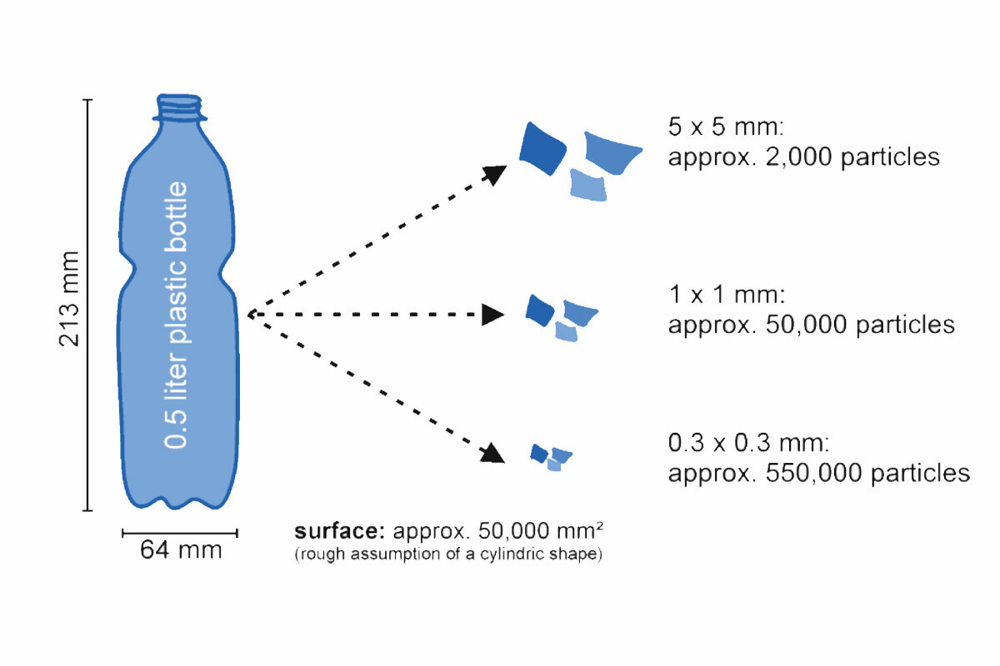
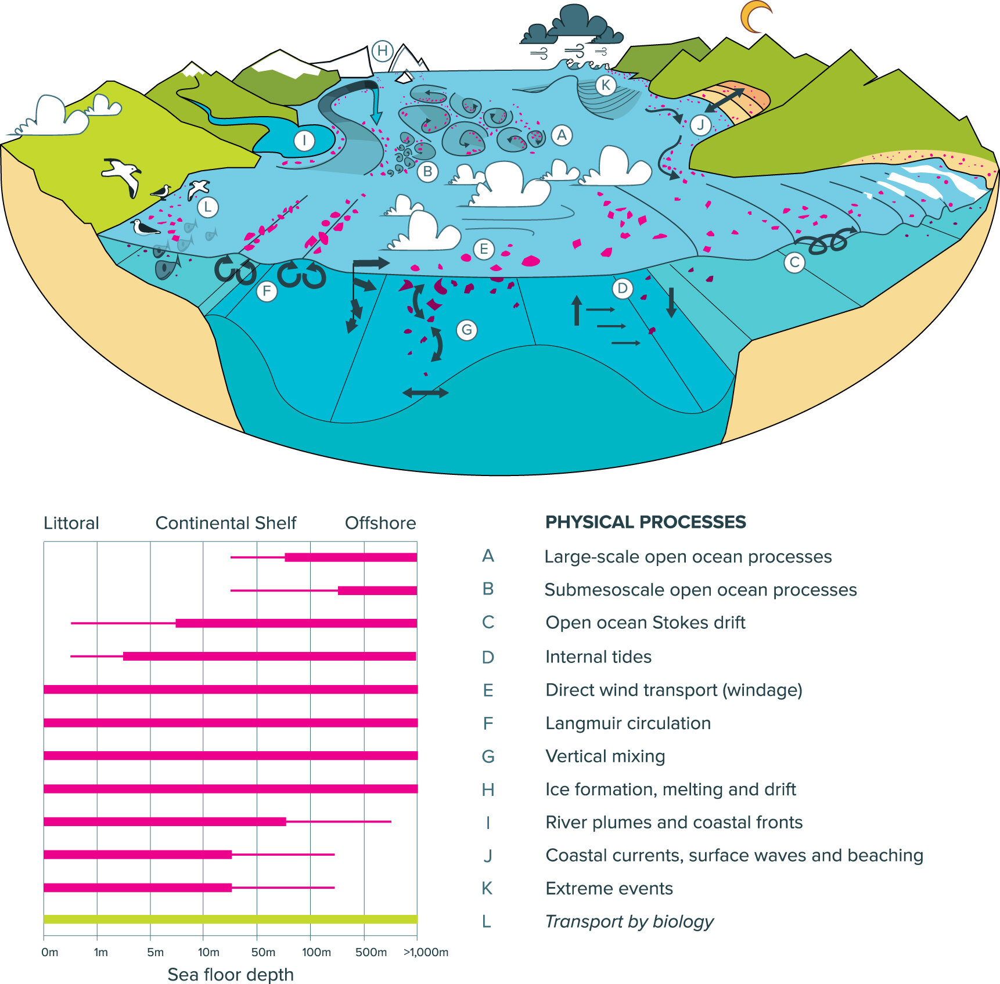

See post on Nivero's [website](https://www.nivero.no/blogg/plastavfall-i-fjordene)

På vei til å rengjøre fjordene fra plastavfall ved hjelp av data og droner – SEAPLAN-prosjektet.
Bakgrunn

Søppel og plast i mikroskala har blitt et viktig tema de siste årene. Oppmerksomheten rundt stort søppel og plast (makroplast) som ender opp i havet har vært relativt liten.

Makroplast inkluderer plastpartikler som er større enn 5 mm som kommer fra både land og sjø. Dette inkluderer søppel fra skip, byggevarer, fiskeutstyr, deponiavfall, akvakulturavfall, tapt last og så videre.

Makroplast er et viktig tema fordi i fravær av lys, en jevn lav temperatur, bølger (unntatt i grunne kystområder) kan plastelementer på havbunnen antas å være stabile. Nedbrytning kan forekomme, men i en veldig lav hastighet. Dermed er det økende bevis for at mengder søppel på havbunnen vokser kontinuerlig. I kystområdene kan imidlertid makroplast bryte ut i mikroplast på grunn av høy UV-stråling og bølgebevegelser.

Teoretisk mengde av mikroplastpartikler ved nedbrytning av 0,5 l plastflaske (1)

SEAPLAN – Motivasjonen bak prosjektet

Plastavfallslekkasje til akvatiske økosystemer i 2016 ble anslått til: 19–23 Mt per år (2). Mengden plast som kommer inn i miljøet vil dermed sannsynligvis øke betydelig selv under ambisiøse scenarier for systemendringer.

I SEAPLAN-prosjektet ønsker vi å få bedre kontroll på hvor plasten samler seg i de norske fjordene. Dette vil vi gjøre ved å kombinere tilgjengelige havdata og data fra undervannsdroner.

I prosjektet har vi med oss to partnere. Høgskolen i Molde og JM Robotics. Disse partnerne er viktige for å kunne gjennomføre prosjektet slik vi ønsker det.

Ved å bygge modeller og bruke datavitenskapelig metoder ønsker vi å simulere mulige flekker av plastakkumulering på havbunnen. Modellerte "plastflekker" vil da bli bekreftet av undervannsdroner som vil ta bilder av alt materiale som ligger på havbunnen.

Vi tar sikte på å utvikle en dyp læringsalgoritme som automatisk vil kunne gjenkjenne søppel basert på bilder tatt av dronene, slik at droner i fremtiden kan operere autonomt og søke etter avfallet i fjordene.
Tekniske utfordringer

I løpet av prosjektet må vi overvinne flere tekniske aspekter som grovt kan settes inn i 2 grupper:

1. Modellering av plastakkumulering på havbunnen

2. Gjenkjenning av plast under vann ved hjelp av maskinlæring og tilgjengelig droneteknologi.

Modellering av plasttransporten er vanskelig av flere grunner. For det første vet vi ikke akkurat hvor plast og søppel kommer fra. Vi kan anta at en del av plasten kommer fra byer, trålere, cruiseskip eller er mistet fiskeutstyr. Men hvor nøyaktig, og hvor mye? – dette har vi ikke data på, enda.

Hvordan plasten synker er drevet av mange komplekse fysiske (hydrodynamikk) prosesser knyttet til vannsirkulasjon (se figur nedenfor). Hvordan plasten synker avhenger også av størrelse, form, tetthet osv.

Simplifisert diagram av fysiske prosesser som påvirker plasttransport (rosa flekker) i havområder. Tabell (nederst) viser i hvilke områder prosessene er viktige (3).

Noen fysiske prosesser er beskrevet av matematiske ligninger, så teoretisk kan plasttransport og akkumulering være mulig å modellere. Pålitelig modellering er imidlertid avhengig av detaljerte data som ofte ikke er tilgjengelige, eller er usikre.

Gode og detaljerte data er imidlertid svært store. For eksempel, vannsirkulasjonsmodeller overstiger ofte titalls Terabyte, noe som kan gjøre modelleringen veldig vanskelig.. Derfor bruker MIT-forskere NASA-datamaskiner for sine simuleringer av plasttransport i havet.

Når det gjelder søppelgjenkjenning ved hjelp av bilder og video tatt av droner, må vi overvinne andre utfordringer. Den første er nøyaktig plassering av droneposisjonen (GPS fungerer ikke under vann). For det andre er avstand til fotograferte objekter informasjon man ikke får med vanlige/video løsninger. Da må man bruke stereoskopiske eller andre løsninger. Andre utfordringer inkluderer bevegelsesuskarphet, dårlig kamerakvalitet, belysning og kjøretøyhastig. Alt dette påvirker også muligheten til å bruke dataene til kvantitativ analyse av søppel på havbunnen.

Vi håper å overvinne utfordringene ved å bruke Nivero, Høgskolen i Molde og JM Robotics sin kompetanse. Dette prosjektet er et første skritt for å evaluere muligheter. Seinere håper vi å kunne utvikle teknologier og løsninger som kan være med å bidra i arbeidet mot marin forsøpling. 

Vi er veldig opptatt av samarbeid, og i dette prosjektet er vi helt avhengig av det. Har du noe informasjon eller ønsker å samarbeide, så ta gjerne kontakt.

Les mer om prosjektet her.

Referanser:

1. Lechthaler S et al. The Way of Macroplastic through the Environment. 2020. Environments 7 73

2. Borrelle S et al. Predicted growth in plastic waste exceeds efforts to mitigate plastic pollution. 2020. Science 369 6510

3. van Sebille E et al. 2020 Environmental Research Letters 15 023003
